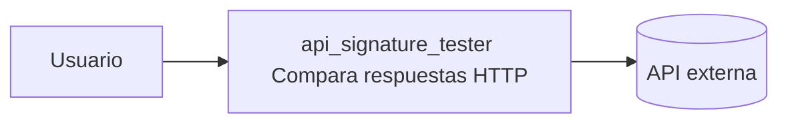
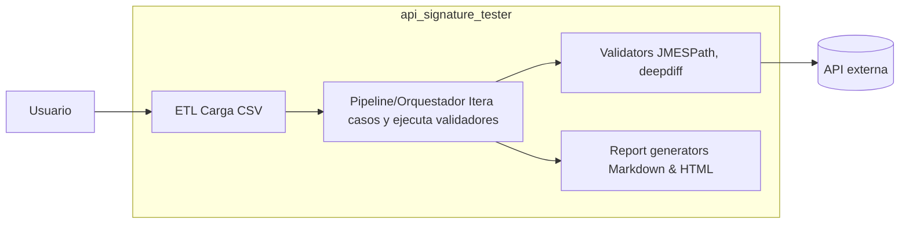
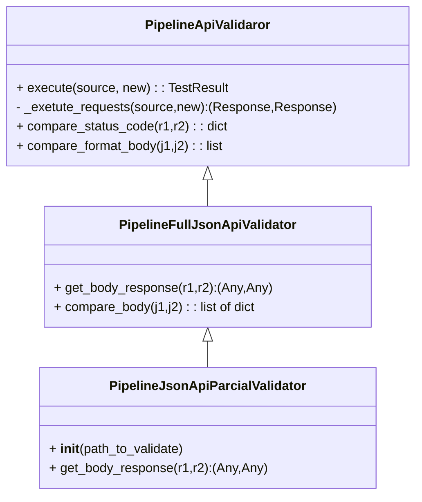

# Arquitectura del proyecto `api_signature_tester`

Este documento describe la arquitectura del proyecto, las responsabilidades de cada módulo y cómo se relacionan entre sí. Incluye diagramas C4 y UML facilitar la comprensión.

---

## Visión general

`api_signature_tester` es una herramienta para comparar respuestas HTTP entre dos versiones/entornos de un mismo endpoint (p. ej. production vs staging). El proceso principal:

1. Cargar casos de prueba (CSV) — ETL
2. Por cada caso, ejecutar dos requests (source y new) — Pipeline
3. Comparar status codes y cuerpos (JSON completo o parcial con JMESPath) — Validator
4. Generar reportes legibles (Markdown + HTML) — Report

---

## Componentes y responsabilidades

### 1) ETL (`src/api_signature_tester/etl`)
- **Responsabilidad:** Leer y transformar entradas externas (CSV) en objetos internos (`TestData`, `EndpointData`) que el resto del sistema puede consumir.
- **Clases principales:**
  - `LoaderCsv` (implementa `ETLProccess`): parsea el CSV, convierte cadenas `a=1&b=2` en dicts, crea `EndpointData` para `source` y `new`.
  - `ETLDataProcess`, `TestData` (contenedores de los datos cargados y errores de carga).
- **Notas:** El loader omite la primera fila (cabecera) y acumula errores de filas sin detener la carga completa.

---

### 2) Pipeline / Orquestador (`src/api_signature_tester/pipeline`)
- **Responsabilidad:** Orquestar la ejecución de todos los casos leídos por el ETL, invocar los validadores y consolidar resultados; invocar generadores de reportes.
- **Clases principales:**
  - `ApiSignatureTesterSynchBase`: método `execute()` que carga los casos, itera, llama `execute_test_case` y luego `generate_report`.
- **Notas:** Actualmente ejecuta los casos de forma síncrona. Se podría extender para ejecución paralela.

---

### 3) Validator (`src/api_signature_tester/validator`)
- **Responsabilidad:** Ejecutar las requests a `source` y `new`, comparar status codes y cuerpos y producir `ComparationResult` normalizado.
- **Clases principales:**
  - `PipelineApiValidaror` (abstracta): define `execute`, `_exetute_requests`, `compare_status_code`, `compare_format_body`, `create_body_diff`.
  - `PipelineFullJsonApiValidator`: compara todo el JSON usando `deepdiff`.
  - `PipelineJsonApiParcialValidator`: aplica `jmespath.search(path, json)` antes de comparar para validar solo una porción del JSON.
- **Notas:** Si alguno de los cuerpos no es JSON, se retorna un diff de formato en lugar de fallar.

---

### 4) Report (`src/api_signature_tester/report`)
- **Responsabilidad:** Generar informes legibles (Markdown y HTML) a partir de la colección de `TestResult`.
- **Clases principales:**
  - `MarkdownReportGenerator.generate(test_results, output_file)`
  - `HTMLReportGenerator.generate(test_results, output_file)` — incluye UI básica con filtros y estilos.
- **Notas:** Las rutas de salida se leen desde la configuración (`config/*.json`).

---

## Diagramas

### Diagrama de Contexto (C4)

### Diagrama de Contenedores (C4)

### Diagrama de Clases (Validator / Pipeline)

